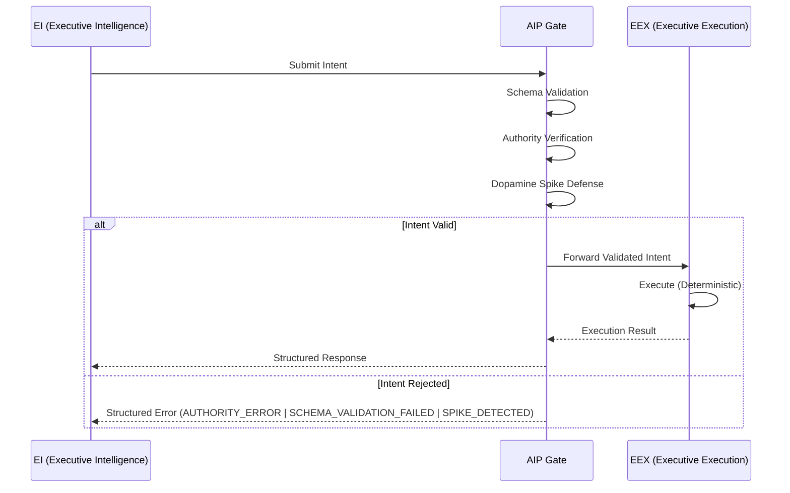

# AIP — Agentic Interaction Protocol

[](https://opensource.org/licenses/Apache-2.0)
[]()
[]()
[]()

> **Status: v0.1.x — Genesis Phase / Active Development**
> This specification is under active development. It is being refined through real-world implementation feedback and is not yet finalized.

**A deterministic governance protocol that structurally decouples AI intent from execution to ensure safety, predictability, and auditability in agentic systems.**

---

## Author & Project Status

**AIP (Agentic Interaction Protocol)** was conceived and authored by **Oto** ([@axonic_aip_oto](https://x.com/axonic_aip_oto)) as a foundational safety standard for autonomous AI systems. The protocol introduces the concept of the **Digital Spinal Cord** — a deterministic governance pathway that structurally isolates intelligence from execution — establishing a new architectural primitive for agentic AI.

AIP is currently in **v0.1.x (Genesis Phase)**. The specification is being actively developed and refined through hands-on implementation — including tools such as `aip-check` — and direct engagement with real-world agentic architectures. This is not a theoretical exercise; AIP is designed to ship as a working standard.

**Governance**: Final authority over the AIP specification rests with Oto and AXONIC. Community contributions, feedback, and constructive proposals are strongly welcomed — this protocol is built in the open, and we believe the best standards emerge through collaboration.

---

## Abstract

As AI agents gain the ability to perform real-world side-effects — writing files, calling APIs, moving funds, deploying infrastructure — the industry faces a fundamental architectural problem: **the same probabilistic system that generates intent is also trusted to execute it.**

AIP (Agentic Interaction Protocol) addresses this by introducing a **structural separation** between the intelligence that decides _what_ to do and the mechanism that _does_ it. This separation is not a policy layer or a prompt-engineering technique. It is a protocol-level constraint enforced through deterministic validation gates.

Think of it as a **Digital Spinal Cord**: the brain (EI) sends signals, but those signals must pass through a governed transmission pathway before they reach the muscles (EEX). Without this pathway, there is no reliable way to guarantee that a complex, probabilistic system behaves within acceptable bounds.

AIP defines the specification for this pathway.

---

## Design Philosophy: Sanity by Design

The core insight behind AIP comes from observing how biological and engineered control systems maintain stability. In any system where a high-entropy signal source (a brain, an LLM) drives real-world actuators, an intermediate governance layer is not optional — it is structurally necessary.

An LLM produces outputs that are probabilistic by nature. This is a feature when generating text. It becomes a liability when those outputs trigger irreversible side-effects. The standard industry approach — wrapping tool calls in retry logic and hope — does not constitute governance. It constitutes tolerance of failure.

AIP takes the position that **sanity must be a structural property, not an emergent one.** The protocol enforces this through three invariants:

1. **The EI layer MUST NOT execute side-effects.** It produces Intents — structured, schema-bound declarations of desired actions.
2. **The EEX layer MUST be deterministic.** Given the same validated Intent, it must always produce the same result. No LLM calls, no probabilistic branching.
3. **The AIP Gate MUST validate every Intent** before it reaches the EEX. Validation includes schema conformance, authority verification, and rate-limit enforcement.

These are not guidelines. They are protocol constraints. A system that violates any of these invariants is, by definition, not AIP-compliant.

---

## Technical Architecture

AIP defines three structural components and the interfaces between them.

### Components

| Component | Nature | Responsibility |
|-----------|--------|---------------|
| **EI (Executive Intelligence)** | Probabilistic | Reasoning, planning, and Intent generation. Typically an LLM or LLM-based agent. |
| **AIP Gate** | Deterministic | Validation bridge. Enforces schema conformance, authority scope, and rate limits. |
| **EEX (Executive Execution)** | Deterministic | Side-effect execution. File I/O, API calls, database writes, infrastructure operations. |

### Flow



### Intent Structure

An Intent is a structured message conforming to a registered schema. At minimum, it contains:

```json
{
  "intent": "file.write",
  "authority": "agent:cli-assistant",
  "params": {
    "path": "/output/report.md",
    "content": "..."
  },
  "timestamp": "2026-03-03T09:00:00Z",
  "nonce": "a1b2c3d4"
}
```

The AIP Gate validates this structure against registered Intent schemas before forwarding to EEX. If any field is missing, malformed, or outside the agent's declared authority scope, the Intent is rejected with a structured error.

---

## Key Features

### Strict Schema Validation

Every Intent type has a registered JSON Schema. The AIP Gate rejects any Intent that does not conform. There is no "best-effort" execution — validation is binary.

### Dopamine Spike Defense

Agentic systems can enter pathological loops where the LLM generates high-frequency, repetitive requests — a pattern analogous to a dopamine feedback loop. AIP implements structural rate-limiting at the Gate level:

- **Frequency Detection**: Monitors Intent submission rate per agent per action type.
- **Pattern Matching**: Identifies repetitive or near-duplicate Intent sequences.
- **Circuit Breaking**: Temporarily blocks the offending agent with a `SPIKE_DETECTED` error and a mandatory cooldown period.

This is not a conventional rate limiter. It is a structural defense against a known failure mode of probabilistic systems driving execution loops.

### Encapsulation of Side-Effects

All side-effects are confined to the EEX layer. This means:

- The EI layer can be swapped, upgraded, or replaced without affecting execution safety.
- The EEX layer can be audited independently of the AI model.
- Testing is simplified: EEX modules are pure deterministic functions over validated Intents.

---

## Project Structure

```
aip/
├── spec/                  # Protocol specification documents
│   ├── aip-core.md        # Core protocol definition
│   ├── intent-schema.md   # Intent schema specification
│   └── gate-rules.md      # AIP Gate validation rules
├── compliance/            # Compliance checklist and testing criteria
│   └── checklist.md       # 10-Item AIP Compliance Checklist
├── aip-check/             # CLI tool for protocol compliance auditing
│   ├── src/
│   └── bin/
│       └── aip-check.js
├── examples/              # Reference implementations
│   ├── typescript/        # TypeScript EEX examples
│   └── python/            # Python EI integration examples
├── CLAUDE.md
└── README.md
```

---

## Compliance

AIP defines a **10-Item Compliance Checklist** that any agentic system must satisfy to be considered protocol-compliant.

The checklist covers:

1. EI/EEX structural separation is enforced at the architecture level.
2. All Intents conform to registered JSON Schemas.
3. The EEX layer contains zero probabilistic logic.
4. All side-effects are confined to EEX modules.
5. An AIP Gate validates every Intent before execution.
6. Authority scoping is enforced per-agent, per-action.
7. Dopamine Spike Defense is active and configured.
8. All Intent rejections produce structured error responses.
9. The EEX layer is independently testable without an EI.
10. Audit logs capture all Intent submissions and Gate decisions.

### aip-check CLI

The `aip-check` tool automates compliance verification:

```bash
# Scan the current project for AIP compliance
node ./bin/aip-check.js scan

# Scan a specific directory
node ./bin/aip-check.js scan --path ./src/agents

# Generate a compliance report
node ./bin/aip-check.js report --format json
```

---

## Roadmap

### Phase 1 — Protocol Specification & Community Review
Define the core specification, publish the draft RFC, and gather feedback from the AI engineering community. Establish the compliance checklist and formalize the Intent schema standard.

### Phase 2 — Tooling Development & Beta Release
Build and release the `aip-check` CLI tool. Provide reference implementations in TypeScript and Python. Develop integration guides for popular agent frameworks.

### Phase 3 — Formal Certification Program
Launch an AIP Certification Program for enterprise agent systems. Provide compliance badges, automated audit pipelines, and partnership integrations with AI platform providers.

---

## How to Contribute

AIP is an open protocol. Contributions are welcome from anyone interested in building safer agentic systems.

- **Specification Feedback**: Open an issue to discuss protocol design decisions.
- **Reference Implementations**: Submit examples of AIP-compliant architectures in any language.
- **Tooling**: Contribute to the `aip-check` CLI or build complementary tools.
- **Compliance Testing**: Help expand the compliance checklist and test suite.

Please read the contribution guidelines before submitting a pull request. All contributions must be in English.

---

## License

This project is licensed under the [Apache License 2.0](https://www.apache.org/licenses/LICENSE-2.0).

---

<p align="center">
  <strong>AXONIC Inc.</strong><br/>
  Building the governance layer for autonomous systems.
</p>
