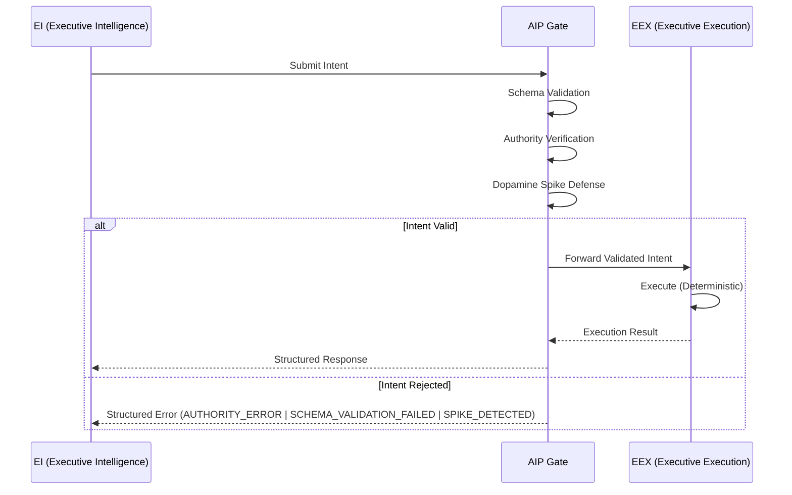

# AIP™ — Agentic Interaction Protocol

[](https://opensource.org/licenses/Apache-2.0)
[]()
[]()
[]()

> **Status: v0.1.x — Genesis Phase / Active Development**
> This specification is under active development. It is being refined through real-world implementation feedback and is not yet finalized.

**A deterministic governance protocol that structurally decouples AI intent from execution to ensure safety, predictability, and auditability in agentic systems.**

---

## Author & Project Status

**AIP™ (Agentic Interaction Protocol)** was conceived and authored by **Oto** ([@axonic_aip_oto](https://x.com/axonic_aip_oto)) as a foundational safety standard for autonomous AI systems. The protocol introduces the concept of the **Digital Spinal Cord™** — a deterministic governance pathway that structurally isolates intelligence from execution — establishing a new architectural primitive for agentic AI.

AIP is currently in **v0.1.x (Genesis Phase)**. The specification is being actively developed and refined through hands-on implementation — including tools such as `aip-check` — and direct engagement with real-world agentic architectures. This is not a theoretical exercise; AIP is designed to ship as a working standard.

**Governance**: Final authority over the AIP™ specification rests with Oto and AXONIC™. Community contributions, feedback, and constructive proposals are strongly welcomed — this protocol is built in the open, and we believe the best standards emerge through collaboration.

---

## Abstract

As AI agents gain the ability to perform real-world side-effects — writing files, calling APIs, moving funds, deploying infrastructure — the industry faces a fundamental architectural problem: **the same probabilistic system that generates intent is also trusted to execute it.**

AIP (Agentic Interaction Protocol) addresses this by introducing a **structural separation** between the intelligence that decides _what_ to do and the mechanism that _does_ it. This separation is not a policy layer or a prompt-engineering technique. It is a protocol-level constraint enforced through deterministic validation gates.

Think of it as a **Digital Spinal Cord™**: the brain (EI™) sends signals, but those signals must pass through a governed transmission pathway before they reach the muscles (EEX™). Without this pathway, there is no reliable way to guarantee that a complex, probabilistic system behaves within acceptable bounds.

AIP defines the specification for this pathway.

---

## Design Philosophy: Sanity by Design

The core insight behind AIP comes from observing how biological and engineered control systems maintain stability. In any system where a high-entropy signal source (a brain, an LLM) drives real-world actuators, an intermediate governance layer is not optional — it is structurally necessary.

An LLM produces outputs that are probabilistic by nature. This is a feature when generating text. It becomes a liability when those outputs trigger irreversible side-effects. The standard industry approach — wrapping tool calls in retry logic and hope — does not constitute governance. It constitutes tolerance of failure.

AIP takes the position that **sanity must be a structural property, not an emergent one.** The protocol enforces this through three invariants:

1. **The EI layer MUST NOT execute side-effects.** It produces Intents — structured, schema-bound declarations of desired actions.
2. **The EEX layer MUST be deterministic.** Given the same validated Intent, it must always produce the same result. No LLM calls, no probabilistic branching.
3. **The AIP Gate MUST validate every Intent** before it reaches the EEX. Validation includes schema conformance, authority verification, and rate-limit enforcement.

These are not guidelines. They are protocol constraints. A system that violates any of these invariants is, by definition, not AIP-compliant.

---

## Technical Architecture

AIP defines three structural components and the interfaces between them.

### Components

| Component | Nature | Responsibility |
|-----------|--------|---------------|
| **EI™ (Executive Intelligence)** | Probabilistic | Reasoning, planning, and Intent generation. Typically an LLM or LLM-based agent. |
| **AIP™ Gate** | Deterministic | Validation bridge. Enforces schema conformance, authority scope, and rate limits. |
| **EEX™ (Executive Execution)** | Deterministic | Side-effect execution. File I/O, API calls, database writes, infrastructure operations. |

### Flow



### Intent Structure

An Intent is a structured message conforming to a registered schema. At minimum, it contains:

```json
{
  "intent": "file.write",
  "authority": "agent:cli-assistant",
  "params": {
    "path": "/output/report.md",
    "content": "..."
  },
  "timestamp": "2026-03-03T09:00:00Z",
  "nonce": "a1b2c3d4"
}
```

The AIP Gate validates this structure against registered Intent schemas before forwarding to EEX. If any field is missing, malformed, or outside the agent's declared authority scope, the Intent is rejected with a structured error.

---

## Key Features

### Strict Schema Validation

Every Intent type has a registered JSON Schema. The AIP Gate rejects any Intent that does not conform. There is no "best-effort" execution — validation is binary.

### DSD™ (Dopamine Spike Defense)

Agentic systems can enter pathological loops where the LLM generates high-frequency, repetitive requests — a pattern analogous to a dopamine feedback loop. AIP™ implements structural rate-limiting at the Gate level:

- **Frequency Detection**: Monitors Intent submission rate per agent per action type.
- **Pattern Matching**: Identifies repetitive or near-duplicate Intent sequences.
- **Circuit Breaking**: Temporarily blocks the offending agent with a `SPIKE_DETECTED` error and a mandatory cooldown period.

This is not a conventional rate limiter. It is a structural defense against a known failure mode of probabilistic systems driving execution loops.

### Encapsulation of Side-Effects

All side-effects are confined to the EEX layer. This means:

- The EI layer can be swapped, upgraded, or replaced without affecting execution safety.
- The EEX layer can be audited independently of the AI model.
- Testing is simplified: EEX modules are pure deterministic functions over validated Intents.

---

## Relation to MCP (Model Context Protocol)

Anthropic's [Model Context Protocol (MCP)](https://modelcontextprotocol.io/) has established an important standard for how LLMs connect to external tools and data sources. AIP recognizes MCP's contribution and positions itself as a complementary — not competing — layer in the agentic stack.

The relationship is best understood through a biological analogy:

- **MCP is the Nervous System.** It solves the **connectivity** problem — how an LLM discovers, negotiates, and communicates with external tools and data. MCP defines the wiring: the standardized protocol through which an agent reaches the outside world.

- **AIP is the Spinal Cord.** It solves the **governance** problem — ensuring that signals traveling through those nerves are validated, authorized, and rate-limited before they reach the muscles. AIP defines the checkpoint: the deterministic boundary that separates intent from execution.

**A nervous system without a spinal cord is a seizure waiting to happen.** An LLM that can freely invoke tools through MCP — without structural governance over what those invocations are allowed to do — has no verifiable safety boundary. Conversely, a spinal cord without nerves has nothing to govern.

### How AIP and MCP Work Together

In an AIP-compliant architecture, MCP operates **within** the EEX (Executive Execution) layer:

```
EI (LLM) ──Intent──▶ AIP Gate ──Validated Intent──▶ EEX ──MCP──▶ Tools / Data
```

The EI generates Intents. The AIP Gate validates them. The EEX executes them — and within the EEX, MCP serves as the connectivity protocol for reaching external services. This is the intended integration pattern: **MCP provides the wiring; AIP governs the signal.**

AIP is designed to function as a **governance superlayer** that can wrap any connectivity protocol — MCP, custom REST APIs, gRPC services, or direct SDK calls. The protocol is transport-agnostic. What it enforces is the structural invariant: no probabilistic system may trigger execution without passing through a deterministic validation gate.

For engineers building on MCP today, adopting AIP means adding a verifiable safety boundary to your existing tool integrations — without replacing any of them.

---

## The AIP Safety Stack

AIP provides two complementary layers of defense — one at build time, one at runtime — forming a complete safety stack for agentic systems.

```
┌─────────────────────────────────────────────────────────────────┐
│                    THE AIP SAFETY STACK                         │
│                                                                 │
│  ┌───────────────────────┐   ┌────────────────────────────────┐ │
│  │  A. STATIC GOVERNANCE │   │  B. DYNAMIC PROTECTION         │ │
│  │     aip-check         │   │     AIP-shield (The Reflex Arc)│ │
│  │                       │   │                                │ │
│  │  Build / Deploy time  │   │  Runtime / Live traffic        │ │
│  │  Source code linting  │   │  Active interception           │ │
│  │                       │   │                                │ │
│  │  "Does the code       │   │  "Is the agent behaving       │ │
│  │   respect the wall?"  │   │   sanely right now?"           │ │
│  └───────────────────────┘   └────────────────────────────────┘ │
│                                                                 │
│  Together: Structural safety from first line of code            │
│            to last millisecond of execution.                    │
└─────────────────────────────────────────────────────────────────┘
```

### A. Static Governance: `aip-check`

| Attribute | Detail |
|-----------|--------|
| **Nature** | Build-time / deployment-time linting |
| **Goal** | Architecture enforcement — verify EI/EEX separation before code ships |
| **Mechanism** | Static analysis of source code: detects prohibited AI SDK imports in EEX modules and MCP components placed outside the EEX boundary |
| **Rules** | `AIP-CORE` (AI SDK in EEX), `AIP-V10.2` (MCP boundary violations) |

`aip-check` answers the question: **"Is this codebase structurally compliant?"** It catches violations at the earliest possible moment — before a single line of code executes.

### B. Dynamic Protection: AIP-shield (The Reflex Arc)

| Attribute | Detail |
|-----------|--------|
| **Nature** | Runtime protection / active interception |
| **Goal** | Real-time prevention of agent "seizures" — runaway loops, token hemorrhage, semantic cycling |
| **Mechanism** | The AIP Gate monitors live Intent traffic, applying the **DSD (Dopamine Spike Defense)** algorithm to detect and halt pathological agent behavior |
| **Response** | `429 SPIKE_DETECTED` with mandatory cooldown; in critical cases, physical termination of the EEX process |

AIP-shield answers the question: **"Is this agent about to cause damage?"** It is the Digital Spinal Cord's reflex arc — an involuntary, deterministic response that fires before the brain (EI) can overrule it.

```
                          ┌─────────────────────────┐
                          │      AIP-shield          │
    Intent                │   ┌─────────────────┐   │              Side-Effect
 EI ─────────────────────▶│   │  DSD Engine      │   │─────────────▶ EEX
   (LLM)                  │   │                   │   │           (Deterministic)
                          │   │  ▸ Velocity Spike │   │
                          │   │  ▸ Token Hemorrhage│  │
                          │   │  ▸ Semantic Loop   │  │
                          │   └────────┬──────────┘   │
                          │            │              │
                          │     SPIKE? ▼              │
                          │   ┌─────────────────┐     │
                          │   │ Circuit Breaker  │     │
                          │   │ 429 + Cooldown   │     │
                          │   │ or KILL (critical)│    │
                          │   └─────────────────┘     │
                          └─────────────────────────┘
```

The three DSD detection metrics:

- **Velocity Spike**: The agent is firing Intents faster than any legitimate workflow would require (e.g., >10 Intents/second). This indicates a reasoning loop or an adversarial prompt injection driving rapid execution.

- **Token Hemorrhage**: Token consumption rate is accelerating abnormally — the agent is generating increasingly large or frequent payloads, burning through compute budget at a rate that suggests loss of coherent control.

- **Semantic Loop**: The agent is submitting Intents that are semantically identical or near-identical to recent submissions. This is the hallmark of an agentic feedback loop — the AI equivalent of a muscle spasm.

When any metric crosses its threshold, the reflex fires: the agent is halted, cooled down, and — if the situation is critical enough — the EEX process is terminated entirely. No negotiation. No retry. The spinal cord does not ask the brain for permission.

---

## Project Structure

```
aip/
├── spec/                  # Protocol specification documents
│   ├── aip-core.md        # Core protocol definition
│   ├── intent-schema.md   # Intent schema specification
│   └── gate-rules.md      # AIP Gate validation rules
├── compliance/            # Compliance checklist and testing criteria
│   └── checklist.md       # 10-Item AIP Compliance Checklist
├── aip-check/             # CLI tool for protocol compliance auditing
│   ├── src/
│   └── bin/
│       └── aip-check.js
├── examples/              # Reference implementations
│   ├── typescript/        # TypeScript EEX examples
│   └── python/            # Python EI integration examples
├── CLAUDE.md
└── README.md
```

---

## Compliance

AIP defines a **10-Item Compliance Checklist** that any agentic system must satisfy to be considered protocol-compliant.

The checklist covers:

1. EI/EEX structural separation is enforced at the architecture level.
2. All Intents conform to registered JSON Schemas.
3. The EEX layer contains zero probabilistic logic.
4. All side-effects are confined to EEX modules.
5. An AIP Gate validates every Intent before execution.
6. Authority scoping is enforced per-agent, per-action.
7. Dopamine Spike Defense is active and configured.
8. All Intent rejections produce structured error responses.
9. The EEX layer is independently testable without an EI.
10. Audit logs capture all Intent submissions and Gate decisions.

### aip-check CLI

The `aip-check` tool automates compliance verification:

```bash
# Scan the current project for AIP compliance
node ./bin/aip-check.js scan

# Scan a specific directory
node ./bin/aip-check.js scan --path ./src/agents

# Generate a compliance report
node ./bin/aip-check.js report --format json
```

---

## Roadmap & Ecosystem

AIP is more than a specification. It is the foundation of an ecosystem designed to make autonomous AI systems safe enough to trust with real-world consequences.

```
┌─────────────────────────────────────────────────────────────────────────┐
│                         THE AIP ECOSYSTEM                              │
│                                                                        │
│   OPEN SOURCE                          ENTERPRISE                      │
│   ──────────                           ──────────                      │
│   aip-check (CLI)                      AIP-shield (Runtime Engine)     │
│   Protocol Spec (SPEC.md)              AIP Certified (Compliance)      │
│   Reference Implementations            Monitoring Dashboard            │
│   Community Extensions                 24/7 Incident Response          │
│                                                                        │
│   Free forever.                        For teams that cannot           │
│   Because safety should                afford a single failure.        │
│   never be gated.                                                      │
└─────────────────────────────────────────────────────────────────────────┘
```

### The AIP Stack

| Layer | Product | Status | Description |
|-------|---------|--------|-------------|
| **Static Governance** | `aip-check` | **Available (OSS)** | Build-time linting that enforces EI/EEX boundary isolation, detects forbidden AI SDK imports, and validates MCP placement. Free, open-source, and designed to run in any CI/CD pipeline. |
| **Dynamic Protection** | `AIP-shield` | **Upcoming** | A high-availability runtime protection engine that can be **retrofitted** onto existing agentic systems. Deploys as a sidecar or gateway — intercepts live Intent traffic, runs DSD analysis, and enforces circuit-breaking in real time. No code rewrite required. |
| **Certification** | `AIP Certified` | **Planned** | A formal compliance certification program for AI agent systems. Organizations that pass the AIP audit receive a verifiable badge — objective proof that their agents operate within governed safety boundaries. |

### Retrofit-First Strategy

Most AI safety frameworks demand that you rebuild from scratch. AIP takes the opposite approach: **add safety without breaking what works.**

AIP is engineered to integrate with the infrastructure you already have:

- **Running agents on OpenAI, Anthropic, or Google?** AIP wraps your existing LLM calls in a governed Intent pipeline — the model stays the same, but every action now passes through a deterministic gate.
- **Using MCP for tool connectivity?** AIP sits above it as a governance superlayer. Your MCP servers keep running inside the EEX boundary; AIP validates every Intent before it reaches them.
- **Custom agent framework?** `aip-check` scans any TypeScript or JavaScript codebase. `AIP-shield` intercepts at the protocol level, not the application level. No vendor lock-in. No framework dependency.

The principle: **you should not have to choose between shipping fast and shipping safely.** AIP is the layer that makes both possible.

### Enterprise-Grade Safety

For organizations operating in high-stakes environments — financial services, critical infrastructure, healthcare, autonomous operations — AIP provides the governance guarantees that regulators and risk committees require:

- **Real-time DSD (Dopamine Spike Defense)**: Continuous monitoring of agent behavior with three-level severity escalation. Runaway agents are halted before they cause economic or physical damage.
- **Auditable Intent Trail**: Every action requested, every Gate decision, every rejection reason — captured in an append-only audit log that satisfies compliance and forensic requirements.
- **Physical Execution Boundary**: The EI/EEX separation is not a policy — it is a structural constraint. Even a fully compromised LLM cannot execute side-effects without passing through the Gate.
- **Kill Switch**: At critical severity, AIP-shield terminates the execution process. This is not a graceful shutdown request. It is a reflex — the Digital Spinal Cord's last line of defense.

### AIP Certified: The Trust Badge for Agentic AI

As autonomous AI agents become integral to business operations, the question shifts from _"Can this agent do the job?"_ to **_"Can this agent be trusted not to cause harm?"_**

**AIP Certified** will provide the answer:

- A standardized, auditable compliance program based on the AIP 10-Item Checklist.
- Automated verification via `aip-check` and runtime validation via `AIP-shield`.
- A publicly verifiable badge that signals to customers, partners, and regulators: _this system operates within governed safety boundaries._

The goal is not to create a bureaucratic gate. It is to give the market a **clear, binary signal** for agent safety — the same role that SOC 2 plays for cloud security or ISO 27001 plays for information security.

### Development Roadmap

| Phase | Focus | Status |
|-------|-------|--------|
| **Phase 1** — Genesis | Core protocol specification, `aip-check` CLI, reference implementations, community review | **In Progress** |
| **Phase 2** — Hardening | `AIP-shield` runtime engine (beta), MCP integration guides, Python SDK, expanded rule set | Next |
| **Phase 3** — Certification | AIP Certified compliance program, enterprise dashboard, automated audit pipelines | Planned |
| **Phase 4** — Ecosystem | Partner integrations (AI platform providers, cloud vendors), language-specific SDKs, framework adapters | Vision |

---

## How to Contribute

AIP is an open protocol. Contributions are welcome from anyone committed to building safer agentic systems.

- **Specification Feedback**: Open an issue to discuss protocol design decisions.
- **Reference Implementations**: Submit examples of AIP-compliant architectures in any language.
- **Tooling**: Contribute to the `aip-check` CLI or build complementary tools.
- **Compliance Testing**: Help expand the compliance checklist and test suite.
- **Integrations**: Build AIP adapters for your preferred agent framework or AI platform.

Please read the [contribution guidelines](CONTRIBUTING.md) before submitting a pull request. All contributions must be in English.

---

## Trademarks & Intellectual Property

The following terms are trademarks owned by **Oto** and **AXONIC™**:

> **AIP™**, **AXONIC™**, **Digital Spinal Cord™**, **DSD™ (Dopamine Spike Defense)**, **EI™ (Executive Intelligence)**, and **EEX™ (Executive Execution)**.

- **Proprietary Terminology**: The terms "Executive Intelligence" (EI™) and "Executive Execution" (EEX™), as defined within the context of this protocol, are proprietary architectural concepts coined by the author. They describe a specific structural separation pattern unique to the AIP™ specification and are not intended as generic industry vocabulary.
- **License Scope**: The [Apache License 2.0](https://www.apache.org/licenses/LICENSE-2.0) applies to the source code and specification text in this repository. **The license does NOT grant any rights** to use the above trademarks for branding, product naming, marketing materials, or competing standards without express written permission from Oto and AXONIC™.
- **Acceptable Use**: You may reference these terms when describing compatibility with or implementation of the AIP™ protocol (e.g., "AIP™-compatible" or "implements the AIP™ specification"), provided such use does not imply endorsement by or affiliation with AXONIC™ unless explicitly authorized.

---

## License

This project is licensed under the [Apache License 2.0](https://www.apache.org/licenses/LICENSE-2.0).

---

<p align="center">
  <strong>AXONIC™ Inc.</strong><br/>
  <em>We are building the trust layer for the agentic future.</em><br/>
  <sub>AIP™, Digital Spinal Cord™, DSD™, EI™, and EEX™ are trademarks of Oto and AXONIC™.</sub>
</p>
