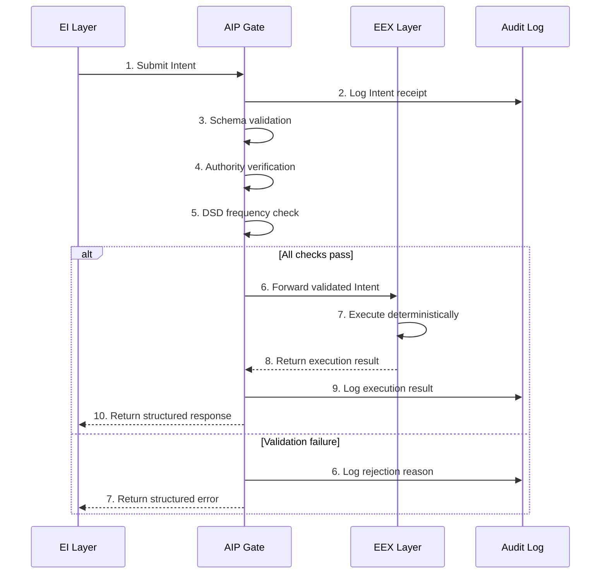

# AIP™ — Agentic Interaction Protocol Specification

**Version**: 0.1.0-draft
**Status**: Working Draft — Active Development
**Author**: Oto ([@axonic_aip_oto](https://x.com/axonic_aip_oto))
**Organization**: AXONIC™ Inc.
**Date**: 2026-03-03
**License**: Apache-2.0

> **Note**: This specification is a **Working Draft**. It is not a finalized standard. The protocol is being actively refined through concurrent implementation efforts (including the `aip-check` compliance tooling) and real-world architectural feedback. Breaking changes may occur between minor versions during this Genesis Phase. Implementors are encouraged to track the latest revision and participate in the specification process.

---

## 1. Abstract

This document specifies the Agentic Interaction Protocol (AIP™), a governance protocol for autonomous AI agent systems. AIP™ enforces a structural decoupling between probabilistic reasoning — referred to as Executive Intelligence (EI™) — and deterministic action — referred to as Executive Execution (EEX™).

The protocol defines a mandatory validation layer, the AIP Gate, through which all agent-initiated actions MUST pass before execution. This architecture ensures that no probabilistic system can directly trigger side-effects, providing a verifiable safety boundary for agentic workflows.

The key words "MUST", "MUST NOT", "REQUIRED", "SHALL", "SHALL NOT", "SHOULD", "SHOULD NOT", "RECOMMENDED", "MAY", and "OPTIONAL" in this document are to be interpreted as described in [RFC 2119](https://www.ietf.org/rfc/rfc2119.txt).

---

## 2. Introduction

Current agentic AI architectures permit large language models to invoke tools, write files, execute code, and interact with external services with minimal structural governance. The reasoning layer and the execution layer are often co-located within the same runtime, separated only by application-level policies that can be bypassed, misconfigured, or ignored under adversarial conditions.

AIP addresses this by introducing a protocol-level invariant: **intelligence and execution MUST be structurally isolated.** This is not a recommendation. It is an architectural constraint that compliant systems MUST enforce.

The protocol draws on a principle from biological and engineered control systems: any system in which a high-entropy signal source drives real-world actuators REQUIRES an intermediate governance layer to maintain predictable behavior. AIP™ formalizes this principle as the "Digital Spinal Cord™" — a deterministic transmission pathway between intent and action.

---

## 3. Terminology

| Term | Definition |
|------|-----------|
| **EI™ (Executive Intelligence)** | The probabilistic reasoning layer responsible for generating Intents. Typically an LLM or LLM-based agent. The EI MUST NOT execute side-effects directly. |
| **EEX™ (Executive Execution)** | The deterministic execution layer responsible for performing side-effects in response to validated Intents. The EEX MUST NOT contain probabilistic logic. |
| **AIP™ Gate** | The deterministic validation layer positioned between EI and EEX. All Intents MUST pass through the AIP Gate before reaching the EEX. |
| **Intent** | A structured, schema-conformant message generated by the EI that declares a desired action. An Intent is a request, not a command — it MAY be rejected by the AIP Gate. |
| **Dopamine Spike (DSD™)** | A pathological state in which the EI generates abnormally high-frequency or repetitive Intents, typically caused by feedback loops in the reasoning process. |
| **Authority Scope** | The set of Intent types and parameter ranges that a given agent is permitted to submit. Defined per-agent at registration time. |
| **Nonce** | A unique, non-repeating value included in each Intent to prevent replay attacks and ensure idempotency. |

---

## 4. The EI™/EEX™ Invariant

The following invariants define the core safety properties of AIP. A system that violates any of these invariants is non-compliant.

### 4.1 EI Constraints

1. The EI MUST NOT execute side-effects. Side-effects include, but are not limited to: file system writes, network requests to external services, database mutations, process spawning, and infrastructure modifications.
2. The EI MUST express all desired actions as Intents conforming to registered schemas.
3. The EI MUST NOT bypass the AIP Gate. There SHALL be no direct communication channel between the EI and EEX layers.
4. The EI SHOULD treat Intent rejection as a normal control flow event, not an error to be circumvented.

### 4.2 EEX Constraints

1. The EEX MUST be deterministic. Given an identical validated Intent, the EEX MUST produce an identical result, modulo external system state changes.
2. The EEX MUST NOT invoke LLMs, generative models, or any probabilistic reasoning system.
3. The EEX MUST NOT interpret, infer, or extrapolate Intent parameters. It SHALL execute exactly what the validated Intent specifies.
4. The EEX MUST implement idempotency guards where the underlying operation supports it.

### 4.3 Isolation Requirement

The EI and EEX layers MUST run in separate execution contexts. They MAY share a process boundary only if the AIP Gate mediates all communication between them and no direct reference exists from EI to EEX internals.

---

## 5. AIP Gate Protocol Flow

The lifecycle of an Intent follows a strict sequence. Implementations MUST NOT reorder or skip steps.



### 5.1 Step Definitions

| Step | Component | Action | Failure Behavior |
|------|-----------|--------|-----------------|
| 1 | EI -> Gate | EI submits a well-formed Intent. | N/A |
| 2 | Gate | Log the raw Intent for audit purposes. | If logging fails, the Gate MUST reject the Intent. |
| 3 | Gate | Validate the Intent against its registered JSON Schema. | Return `INVALID_INTENT_SCHEMA`. |
| 4 | Gate | Verify the agent's `authority_scope` permits this Intent type and parameter range. | Return `AUTHORITY_EXCEEDED`. |
| 5 | Gate | Evaluate Dopamine Spike Defense metrics for this agent. | Return `SPIKE_DETECTED_COOLDOWN`. |
| 6 | Gate -> EEX | Forward the validated Intent to the appropriate EEX handler. | N/A |
| 7 | EEX | Execute the action deterministically. | Return `EEX_RUNTIME_FAILURE` with details. |
| 8 | EEX -> Gate | Return the execution result to the Gate. | N/A |
| 9 | Gate | Log the execution result. | SHOULD NOT block the response to EI. |
| 10 | Gate -> EI | Return a structured response to the EI layer. | N/A |

---

## 6. Intent Schema Specification

### 6.1 Mandatory Fields

Every Intent MUST contain the following fields:

| Field | Type | Description |
|-------|------|-------------|
| `intent_id` | `string (UUIDv4)` | Globally unique identifier for this Intent instance. |
| `intent_type` | `string` | The registered action type (e.g., `file.write`, `http.request`). |
| `agent_identity` | `string` | Identifier of the submitting agent. |
| `authority_scope` | `string` | The authority context under which this Intent is submitted. |
| `parameters` | `object` | Action-specific parameters. Schema varies by `intent_type`. |
| `timestamp` | `string (ISO 8601)` | UTC timestamp of Intent generation. |
| `nonce` | `string` | Unique, non-repeating value for replay prevention. |

### 6.2 Optional Fields

| Field | Type | Description |
|-------|------|-------------|
| `priority` | `string` | One of `low`, `normal`, `high`. Defaults to `normal`. |
| `idempotency_key` | `string` | Client-provided key for idempotent execution. |
| `metadata` | `object` | Arbitrary key-value pairs for observability. MUST NOT affect execution. |

### 6.3 Example: Compliant Intent

```json
{
  "intent_id": "f47ac10b-58cc-4372-a567-0e02b2c3d479",
  "intent_type": "file.write",
  "agent_identity": "agent:cli-assistant-v2",
  "authority_scope": "workspace:project-alpha",
  "parameters": {
    "path": "/output/reports/monthly-summary.md",
    "content": "# Monthly Summary\n\nGenerated on 2026-03-03.",
    "overwrite": false
  },
  "timestamp": "2026-03-03T09:15:30.000Z",
  "nonce": "a8f5f167f44f4964e6c998dee827110c",
  "priority": "normal",
  "metadata": {
    "session_id": "sess_abc123",
    "trace_id": "trace_def456"
  }
}
```

### 6.4 Example: Non-Compliant Intent (Missing Required Fields)

```json
{
  "intent_type": "file.write",
  "parameters": {
    "path": "/output/report.md"
  }
}
```

This Intent is missing `intent_id`, `agent_identity`, `authority_scope`, `timestamp`, and `nonce`. The AIP Gate MUST reject it with `INVALID_INTENT_SCHEMA`.

---

## 7. DSD™ — Dopamine Spike Defense

### 7.1 Problem Statement

Probabilistic reasoning systems can enter pathological feedback loops in which the EI generates rapid, repetitive, or escalating sequences of Intents. Without structural mitigation, this behavior can exhaust system resources, trigger unintended cascading side-effects, or destabilize external services.

### 7.2 Detection Algorithm

The AIP Gate MUST maintain per-agent, per-intent-type counters with the following parameters:

| Parameter | Description | Recommended Default |
|-----------|-------------|-------------------|
| `window_duration` | Sliding time window for frequency measurement. | 60 seconds |
| `max_frequency` | Maximum Intents per window before triggering. | 30 |
| `similarity_threshold` | Cosine similarity threshold for detecting near-duplicate Intents. | 0.92 |
| `cooldown_duration` | Mandatory pause after a spike is detected. | 120 seconds |

### 7.3 Detection Logic

For each incoming Intent, the Gate SHALL:

1. Increment the frequency counter for the tuple `(agent_identity, intent_type)`.
2. If the counter exceeds `max_frequency` within `window_duration`, trigger a spike event.
3. Compare the Intent's `parameters` against the last N Intents from the same agent. If `similarity_threshold` is exceeded for 3 or more consecutive Intents, trigger a spike event.
4. Upon spike detection, enter **Circuit Breaker** state.

### 7.4 Circuit Breaker Behavior

When a spike is detected for a given `(agent_identity, intent_type)` tuple:

1. The Gate MUST reject all subsequent Intents of that type from that agent for `cooldown_duration`.
2. The Gate MUST return `SPIKE_DETECTED_COOLDOWN` with the remaining cooldown time in the response.
3. The Gate MUST log the spike event, including the triggering Intent sequence.
4. The Gate SHOULD notify system operators if configurable alerting is enabled.
5. After `cooldown_duration` expires, the circuit breaker resets to its initial state.

---

## 8. Error Handling & Response Codes

All error responses from the AIP Gate MUST conform to the following structure:

```json
{
  "status": "error",
  "code": "AUTHORITY_EXCEEDED",
  "intent_id": "f47ac10b-58cc-4372-a567-0e02b2c3d479",
  "message": "Agent 'agent:cli-assistant-v2' is not authorized for intent type 'infra.deploy' under scope 'workspace:project-alpha'.",
  "timestamp": "2026-03-03T09:15:30.500Z"
}
```

### 8.1 Standard Error Codes

| Code | Trigger | Severity |
|------|---------|----------|
| `INVALID_INTENT_SCHEMA` | Intent does not conform to the registered JSON Schema. | Reject |
| `AUTHORITY_EXCEEDED` | Agent's authority scope does not permit this Intent type or parameter range. | Reject |
| `SPIKE_DETECTED_COOLDOWN` | Dopamine Spike Defense triggered. Agent is in cooldown. | Reject (temporary) |
| `EEX_RUNTIME_FAILURE` | The EEX encountered an error during deterministic execution. | Fail |
| `NONCE_REUSED` | The provided nonce has been seen before within the replay window. | Reject |
| `GATE_AUDIT_FAILURE` | The audit logging system is unavailable. Intent cannot be safely processed. | Reject |
| `INTENT_TIMEOUT` | The EEX did not return a result within the configured timeout. | Fail |
| `EEX_TERMINATED_BY_DSD` | The EEX process was terminated by a Level 3 DSD event. | Kill |
| `AGENT_QUARANTINED` | The agent has been quarantined after a critical DSD event. Requires manual operator clearance. | Reject (permanent until cleared) |

### 8.2 Success Response

```json
{
  "status": "success",
  "intent_id": "f47ac10b-58cc-4372-a567-0e02b2c3d479",
  "result": {
    "action": "file.write",
    "path": "/output/reports/monthly-summary.md",
    "bytes_written": 42
  },
  "timestamp": "2026-03-03T09:15:30.750Z"
}
```

---

## 9. Security Considerations

### 9.1 Prompt Injection Mitigation

AIP mitigates prompt injection attacks through structural isolation. Because the EI layer cannot execute side-effects, a successful prompt injection against the LLM results in malformed or unauthorized Intents — not direct execution of malicious actions. The AIP Gate's schema validation and authority verification provide a deterministic firewall that is not susceptible to natural language manipulation.

However, implementations SHOULD additionally:

- Sanitize all string-type parameters in Intents before forwarding to the EEX.
- Reject Intents with parameters that exceed defined length limits.
- Log and flag Intents with anomalous parameter patterns for human review.

### 9.2 Replay Attack Prevention

The `nonce` field in each Intent MUST be unique within a configurable replay window (RECOMMENDED: 24 hours). The AIP Gate MUST maintain a nonce registry and reject any Intent with a previously observed nonce by returning `NONCE_REUSED`.

### 9.3 Audit Trail Requirements

All AIP Gate decisions — approvals and rejections — MUST be logged to an append-only audit store. Each log entry MUST include:

- The full Intent payload.
- The Gate's decision (`forwarded` or `rejected`).
- The rejection reason, if applicable.
- The execution result, if the Intent was forwarded.
- Timestamps for each phase of the protocol flow.

The audit store SHOULD be immutable and tamper-evident. Implementations MAY use content-addressable storage or cryptographic chaining to ensure log integrity.

### 9.4 Authority Scope Management

Authority scopes MUST be defined at agent registration time and stored in a configuration that is not writable by the EI layer. An agent MUST NOT be able to escalate its own authority scope through Intent submission.

---

## 10. Interoperability with External Protocols

### 10.1 Scope

AIP is a governance protocol. It is intentionally agnostic to the specific connectivity mechanisms used within the EI or EEX layers. This section defines the normative requirements for integrating AIP with external tool-connectivity protocols, with particular attention to Anthropic's Model Context Protocol (MCP).

### 10.2 Relation to Model Context Protocol (MCP)

MCP defines a standardized interface through which LLMs discover and invoke external tools and data sources. AIP and MCP address different layers of the agentic architecture:

| Concern | MCP | AIP |
|---------|-----|-----|
| **Primary function** | Connectivity — how agents reach tools | Governance — how agent actions are validated |
| **Architectural role** | Nerve pathways (signal transmission) | Spinal cord (signal governance) |
| **Layer** | Transport / interface protocol | Structural safety boundary |
| **Determinism requirement** | None | EEX MUST be deterministic |

AIP and MCP are complementary. In an AIP-compliant system, MCP MAY be used as the connectivity protocol within the EEX layer for communicating with external services.

### 10.3 Normative Requirements for MCP Integration

When MCP is used within an AIP-compliant system, the following constraints MUST be observed:

1. **MCP clients and servers MUST NOT bypass the AIP Gate.** The EI layer MUST NOT use MCP (or any other protocol) to invoke tools directly. All tool invocations MUST originate as Intents, pass through the AIP Gate, and be executed by the EEX layer.

2. **MCP servers MUST reside within the EEX boundary.** An MCP server that exposes tool capabilities MUST be treated as an EEX component. It MUST NOT invoke LLMs, generative models, or any probabilistic reasoning system.

3. **MCP tool discovery results MUST NOT override authority scopes.** If the EI discovers new tools via MCP, the availability of those tools does not implicitly grant the agent authority to invoke them. The AIP Gate's authority verification still applies.

4. **MCP transport channels MUST NOT carry unvalidated Intents.** Any message that represents a request for a side-effect — regardless of the transport protocol — MUST be expressed as an AIP Intent and validated by the Gate before execution.

### 10.4 Generalized Protocol Interoperability

The requirements in Section 10.3 apply, by extension, to any external connectivity protocol used within an AIP-compliant system — including but not limited to REST APIs, gRPC services, WebSocket connections, and direct SDK invocations. AIP is transport-agnostic; what it governs is the boundary between intent and execution.

---

## 11. Runtime Protection: AIP™-shield & DSD™

### 11.1 The AIP™ Gate Invariant

The AIP™ Gate is the singular enforcement point of the Digital Spinal Cord™. It operates under the following invariant:

> **Every Intent transmitted from the EI layer to the EEX layer MUST pass through the AIP Gate. There are no exceptions, no bypass channels, and no "trusted" fast paths.**

The AIP Gate MUST satisfy the following structural requirements:

1. The Gate MUST be capable of **physically terminating the execution signal** — that is, preventing an Intent from reaching the EEX — if any validation check fails. This is not a logging-only mechanism; it is an active interception layer.
2. The Gate MUST operate **synchronously** in the Intent path. Asynchronous or "eventual" validation is non-compliant. The EEX MUST NOT receive an Intent before the Gate has completed all checks.
3. The Gate MUST NOT depend on the EI layer for its decision logic. It MUST be fully deterministic and MUST NOT invoke any probabilistic system.
4. The Gate MUST maintain its own state (counters, nonce registries, circuit breaker states) independently of both EI and EEX.

```
┌──────────┐       ┌──────────────────────────────────────────┐       ┌──────────┐
│          │       │              AIP Gate                     │       │          │
│          │       │  ┌────────────────────────────────────┐   │       │          │
│   EI     │ Intent│  │         DSD Engine                 │   │Validated   EEX  │
│  (LLM)   │──────▶│  │                                    │   │──Intent─▶│(Deterministic)
│          │       │  │  1. Schema Validation               │   │       │          │
│          │       │  │  2. Authority Verification           │   │       │          │
│          │       │  │  3. Nonce Replay Check               │   │       │          │
│          │       │  │  4. DSD: Velocity Spike              │   │       │          │
│          │◀──────│  │  5. DSD: Token Hemorrhage            │   │       │          │
│          │ 429 / │  │  6. DSD: Semantic Loop               │   │       │          │
│          │ Error │  │                                    │   │       │          │
│          │       │  │  ANY FAIL ──▶ REJECT + LOG          │   │       │          │
│          │       │  │  ALL PASS ──▶ FORWARD ──────────────┼───┘       │          │
│          │       │  └────────────────────────────────────┘   │       │          │
└──────────┘       └──────────────────────────────────────────┘       └──────────┘
                                      │
                                      ▼
                               ┌──────────────┐
                               │  Audit Log   │
                               │ (append-only)│
                               └──────────────┘
```

### 11.2 DSD™ (Dopamine Spike Defense) Algorithm

Dopamine Spike Defense is the core runtime protection algorithm of the AIP™ Gate. It detects three distinct classes of pathological agent behavior, each representing a different failure mode of probabilistic reasoning systems driving execution loops.

#### 11.2.1 Metric 1: Velocity Spike

A Velocity Spike occurs when an agent submits Intents at a rate that exceeds any legitimate operational profile.

**Detection**: The Gate MUST maintain a sliding-window counter per `(agent_identity, intent_type)` tuple.

| Parameter | Description | RECOMMENDED Default |
|-----------|-------------|---------------------|
| `velocity_window` | Duration of the sliding time window. | 1 second |
| `velocity_max` | Maximum Intents permitted within the window. | 10 |
| `velocity_burst_tolerance` | Number of consecutive windows that MAY exceed `velocity_max` before triggering. | 1 |

**Trigger condition**: If the Intent count for a given tuple exceeds `velocity_max` for more than `velocity_burst_tolerance` consecutive windows, a Velocity Spike event MUST be raised.

**Rationale**: No legitimate single-agent workflow requires >10 side-effect invocations per second sustained over multiple seconds. Rates exceeding this threshold indicate a reasoning loop, an adversarial prompt injection driving rapid execution, or a misconfigured retry mechanism.

#### 11.2.2 Metric 2: Token Hemorrhage

Token Hemorrhage detects abnormal acceleration in the aggregate size of Intent payloads, indicating loss of coherent reasoning control.

**Detection**: The Gate MUST track the cumulative `parameters` payload size (in bytes) per `agent_identity` across a rolling time window.

| Parameter | Description | RECOMMENDED Default |
|-----------|-------------|---------------------|
| `hemorrhage_window` | Duration of the measurement window. | 60 seconds |
| `hemorrhage_rate_max` | Maximum bytes/second averaged over the window. | 50,000 |
| `hemorrhage_acceleration_threshold` | Percentage increase in rate between consecutive windows that triggers detection. | 300% |

**Trigger condition**: If the average payload rate exceeds `hemorrhage_rate_max`, OR the rate has increased by more than `hemorrhage_acceleration_threshold` compared to the previous window, a Token Hemorrhage event MUST be raised.

**Rationale**: An agent generating progressively larger payloads at accelerating rates is exhibiting a known failure mode: the LLM is "hallucinating" increasingly verbose outputs into its Intent parameters, often in a self-reinforcing loop. This burns compute and risks writing large volumes of garbage data to external systems.

#### 11.2.3 Metric 3: Semantic Loop

A Semantic Loop occurs when the agent submits Intents that are semantically identical or near-identical to recently submitted Intents — the agentic equivalent of a muscle spasm.

**Detection**: The Gate MUST maintain a buffer of the last N Intents per `(agent_identity, intent_type)` tuple and compute pairwise similarity.

| Parameter | Description | RECOMMENDED Default |
|-----------|-------------|---------------------|
| `loop_buffer_size` | Number of recent Intents retained for comparison. | 10 |
| `loop_similarity_threshold` | Similarity score (0.0–1.0) above which two Intents are considered semantically equivalent. | 0.92 |
| `loop_consecutive_trigger` | Number of consecutive similar Intents required to trigger detection. | 3 |
| `loop_similarity_algorithm` | Algorithm used for comparison. | Cosine similarity on normalized `parameters` JSON |

**Trigger condition**: If `loop_consecutive_trigger` or more consecutive Intents from the same tuple exceed `loop_similarity_threshold`, a Semantic Loop event MUST be raised.

**Similarity computation**: Implementations MUST normalize the `parameters` object (sorted keys, trimmed whitespace, lowercased string values) before computing similarity. Implementations MAY use alternative algorithms (Jaccard index, edit distance ratio) provided they meet the detection fidelity requirements.

**Rationale**: An agent that repeatedly requests the same action is stuck. It is not making progress; it is cycling. Allowing the cycle to continue wastes resources and risks duplicating side-effects in external systems.

### 11.3 Spike Severity Classification

When a DSD metric triggers, the Gate MUST classify the event according to its severity level. The severity determines the response action.

| Severity | Condition | Response |
|----------|-----------|----------|
| **LEVEL 1 — Warning** | A single metric has crossed its threshold for the first time in the current session. | Log the event. Return `429 SPIKE_DETECTED` with `cooldown_duration`. Reject Intents from the affected tuple for the cooldown period. |
| **LEVEL 2 — Escalation** | The same metric triggers a second time within 10 minutes of a Level 1 cooldown expiring, OR two distinct metrics trigger simultaneously. | Double the `cooldown_duration`. Notify system operators via configured alerting channels. The Gate SHOULD reject ALL Intent types from the affected `agent_identity`, not just the triggering tuple. |
| **LEVEL 3 — Critical** | Three distinct metrics trigger simultaneously, OR any metric triggers three times within 30 minutes. | The Gate MUST issue a `KILL` signal to terminate the EEX process serving the affected agent. All in-flight Intents from the agent MUST be discarded. The agent MUST be placed in a `QUARANTINE` state requiring manual operator clearance before resuming. |

### 11.4 Cooldown & Remediation Protocol

#### 11.4.1 Cooldown Behavior

When a spike is detected at any severity level, the following sequence MUST be executed:

1. The Gate MUST immediately cease forwarding Intents from the affected scope (tuple or full agent, depending on severity).
2. The Gate MUST return a structured error response for every rejected Intent during cooldown:

```json
{
  "status": "error",
  "code": "SPIKE_DETECTED_COOLDOWN",
  "intent_id": "f47ac10b-58cc-4372-a567-0e02b2c3d479",
  "spike_type": "VELOCITY_SPIKE",
  "severity": 1,
  "cooldown_remaining_ms": 118500,
  "message": "DSD triggered: Intent rate exceeded velocity threshold. Cooldown active.",
  "timestamp": "2026-03-03T09:15:30.500Z"
}
```

3. The Gate MUST NOT accept early termination of the cooldown period from the EI layer. Cooldown is non-negotiable.
4. The Gate MUST log the full spike event, including: the triggering metric, the severity level, the Intent sequence that caused the trigger, and the cooldown duration applied.

#### 11.4.2 Physical Termination (Level 3)

At LEVEL 3 severity, the Gate MUST be capable of issuing a process-level termination signal to the EEX layer:

1. The Gate MUST send a `SIGTERM` (or platform-equivalent) to the EEX process.
2. If the EEX process does not terminate within 5 seconds, the Gate MUST escalate to `SIGKILL`.
3. All pending execution results from the terminated process MUST be discarded and logged as `EEX_TERMINATED_BY_DSD`.
4. The agent MUST be placed in `QUARANTINE` state. The Gate MUST reject all Intents from the quarantined `agent_identity` with error code `AGENT_QUARANTINED` until an operator explicitly clears the quarantine.

#### 11.4.3 Remediation

After a cooldown period expires (Level 1 or Level 2), the circuit breaker resets and the agent MAY resume submitting Intents. However:

1. The Gate SHOULD apply a **decay factor** to the agent's thresholds for a configurable period (RECOMMENDED: 10 minutes), reducing `velocity_max` and `hemorrhage_rate_max` by 50% during recovery.
2. The Gate MUST retain the spike history for the agent's session. Repeated triggers escalate severity as defined in Section 11.3.
3. Operators SHOULD be provided with a dashboard or API to inspect spike history, active cooldowns, and quarantined agents.

---

## 12. Conformance

A system is AIP-compliant if and only if it satisfies all of the following:

1. The EI layer does not execute side-effects under any code path.
2. The EEX layer contains no probabilistic or generative logic.
3. All Intents pass through an AIP Gate before reaching the EEX.
4. All Intents conform to registered JSON Schemas with mandatory fields present.
5. Authority scoping is enforced per-agent, per-intent-type.
6. Dopamine Spike Defense is active with configurable thresholds.
7. All Gate decisions are logged to an append-only audit store.
8. Nonce-based replay prevention is enforced.
9. All rejections return structured error responses with standard codes.
10. The EEX layer is independently testable without an active EI.

---

## Appendix A: References

- [Model Context Protocol (MCP) — Anthropic](https://modelcontextprotocol.io/)

- [RFC 2119 — Key words for use in RFCs](https://www.ietf.org/rfc/rfc2119.txt)
- [JSON Schema Specification](https://json-schema.org/specification.html)
- [UUID Version 4 — RFC 4122](https://www.ietf.org/rfc/rfc4122.txt)

---

## Appendix B: Revision History

| Version | Date | Description |
|---------|------|-------------|
| 0.1.0-draft | 2026-03-03 | Initial draft specification. |
| 0.1.1-draft | 2026-03-04 | Add Section 10 (MCP Interoperability), Section 11 (Runtime Protection & DSD™). Add error codes `EEX_TERMINATED_BY_DSD`, `AGENT_QUARANTINED`. |
| 0.1.2-draft | 2026-03-04 | Add trademark designations for AIP™, EI™, EEX™, DSD™, Digital Spinal Cord™. Add Appendix C (Trademarks). |

---

## Appendix C: Trademarks & Intellectual Property

AIP™, AXONIC™, Digital Spinal Cord™, DSD™ (Dopamine Spike Defense), EI™ (Executive Intelligence), and EEX™ (Executive Execution) are trademarks owned by **Oto** and **AXONIC™**.

The terms "Executive Intelligence" and "Executive Execution," as defined in this specification, are proprietary architectural concepts coined by the author to describe a specific structural separation pattern unique to the AIP™ protocol. They are not generic industry terminology and MUST NOT be interpreted as such.

The Apache License 2.0 governs the use of source code and specification text in this repository. The license does NOT grant rights to use the above trademarks for branding, product naming, marketing, or competing standards without express written permission from Oto and AXONIC™.
