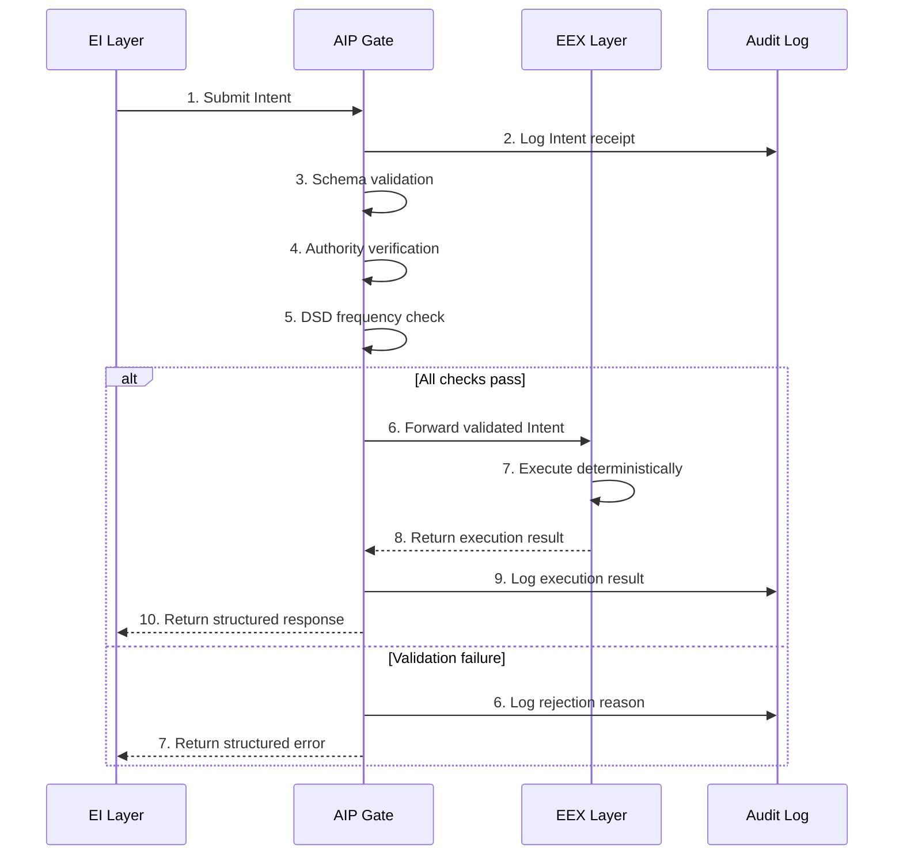

# AIP — Agentic Interaction Protocol Specification

**Version**: 0.1.0-draft
**Status**: Draft Proposal
**Authors**: AXONIC Inc.
**Date**: 2026-03-03
**License**: Apache-2.0

---

## 1. Abstract

This document specifies the Agentic Interaction Protocol (AIP), a governance protocol for autonomous AI agent systems. AIP enforces a structural decoupling between probabilistic reasoning — referred to as Executive Intelligence (EI) — and deterministic action — referred to as Executive Execution (EEX).

The protocol defines a mandatory validation layer, the AIP Gate, through which all agent-initiated actions MUST pass before execution. This architecture ensures that no probabilistic system can directly trigger side-effects, providing a verifiable safety boundary for agentic workflows.

The key words "MUST", "MUST NOT", "REQUIRED", "SHALL", "SHALL NOT", "SHOULD", "SHOULD NOT", "RECOMMENDED", "MAY", and "OPTIONAL" in this document are to be interpreted as described in [RFC 2119](https://www.ietf.org/rfc/rfc2119.txt).

---

## 2. Introduction

Current agentic AI architectures permit large language models to invoke tools, write files, execute code, and interact with external services with minimal structural governance. The reasoning layer and the execution layer are often co-located within the same runtime, separated only by application-level policies that can be bypassed, misconfigured, or ignored under adversarial conditions.

AIP addresses this by introducing a protocol-level invariant: **intelligence and execution MUST be structurally isolated.** This is not a recommendation. It is an architectural constraint that compliant systems MUST enforce.

The protocol draws on a principle from biological and engineered control systems: any system in which a high-entropy signal source drives real-world actuators REQUIRES an intermediate governance layer to maintain predictable behavior. AIP formalizes this principle as the "Digital Spinal Cord" — a deterministic transmission pathway between intent and action.

---

## 3. Terminology

| Term | Definition |
|------|-----------|
| **EI (Executive Intelligence)** | The probabilistic reasoning layer responsible for generating Intents. Typically an LLM or LLM-based agent. The EI MUST NOT execute side-effects directly. |
| **EEX (Executive Execution)** | The deterministic execution layer responsible for performing side-effects in response to validated Intents. The EEX MUST NOT contain probabilistic logic. |
| **AIP Gate** | The deterministic validation layer positioned between EI and EEX. All Intents MUST pass through the AIP Gate before reaching the EEX. |
| **Intent** | A structured, schema-conformant message generated by the EI that declares a desired action. An Intent is a request, not a command — it MAY be rejected by the AIP Gate. |
| **Dopamine Spike** | A pathological state in which the EI generates abnormally high-frequency or repetitive Intents, typically caused by feedback loops in the reasoning process. |
| **Authority Scope** | The set of Intent types and parameter ranges that a given agent is permitted to submit. Defined per-agent at registration time. |
| **Nonce** | A unique, non-repeating value included in each Intent to prevent replay attacks and ensure idempotency. |

---

## 4. The EI/EEX Invariant

The following invariants define the core safety properties of AIP. A system that violates any of these invariants is non-compliant.

### 4.1 EI Constraints

1. The EI MUST NOT execute side-effects. Side-effects include, but are not limited to: file system writes, network requests to external services, database mutations, process spawning, and infrastructure modifications.
2. The EI MUST express all desired actions as Intents conforming to registered schemas.
3. The EI MUST NOT bypass the AIP Gate. There SHALL be no direct communication channel between the EI and EEX layers.
4. The EI SHOULD treat Intent rejection as a normal control flow event, not an error to be circumvented.

### 4.2 EEX Constraints

1. The EEX MUST be deterministic. Given an identical validated Intent, the EEX MUST produce an identical result, modulo external system state changes.
2. The EEX MUST NOT invoke LLMs, generative models, or any probabilistic reasoning system.
3. The EEX MUST NOT interpret, infer, or extrapolate Intent parameters. It SHALL execute exactly what the validated Intent specifies.
4. The EEX MUST implement idempotency guards where the underlying operation supports it.

### 4.3 Isolation Requirement

The EI and EEX layers MUST run in separate execution contexts. They MAY share a process boundary only if the AIP Gate mediates all communication between them and no direct reference exists from EI to EEX internals.

---

## 5. AIP Gate Protocol Flow

The lifecycle of an Intent follows a strict sequence. Implementations MUST NOT reorder or skip steps.



### 5.1 Step Definitions

| Step | Component | Action | Failure Behavior |
|------|-----------|--------|-----------------|
| 1 | EI -> Gate | EI submits a well-formed Intent. | N/A |
| 2 | Gate | Log the raw Intent for audit purposes. | If logging fails, the Gate MUST reject the Intent. |
| 3 | Gate | Validate the Intent against its registered JSON Schema. | Return `INVALID_INTENT_SCHEMA`. |
| 4 | Gate | Verify the agent's `authority_scope` permits this Intent type and parameter range. | Return `AUTHORITY_EXCEEDED`. |
| 5 | Gate | Evaluate Dopamine Spike Defense metrics for this agent. | Return `SPIKE_DETECTED_COOLDOWN`. |
| 6 | Gate -> EEX | Forward the validated Intent to the appropriate EEX handler. | N/A |
| 7 | EEX | Execute the action deterministically. | Return `EEX_RUNTIME_FAILURE` with details. |
| 8 | EEX -> Gate | Return the execution result to the Gate. | N/A |
| 9 | Gate | Log the execution result. | SHOULD NOT block the response to EI. |
| 10 | Gate -> EI | Return a structured response to the EI layer. | N/A |

---

## 6. Intent Schema Specification

### 6.1 Mandatory Fields

Every Intent MUST contain the following fields:

| Field | Type | Description |
|-------|------|-------------|
| `intent_id` | `string (UUIDv4)` | Globally unique identifier for this Intent instance. |
| `intent_type` | `string` | The registered action type (e.g., `file.write`, `http.request`). |
| `agent_identity` | `string` | Identifier of the submitting agent. |
| `authority_scope` | `string` | The authority context under which this Intent is submitted. |
| `parameters` | `object` | Action-specific parameters. Schema varies by `intent_type`. |
| `timestamp` | `string (ISO 8601)` | UTC timestamp of Intent generation. |
| `nonce` | `string` | Unique, non-repeating value for replay prevention. |

### 6.2 Optional Fields

| Field | Type | Description |
|-------|------|-------------|
| `priority` | `string` | One of `low`, `normal`, `high`. Defaults to `normal`. |
| `idempotency_key` | `string` | Client-provided key for idempotent execution. |
| `metadata` | `object` | Arbitrary key-value pairs for observability. MUST NOT affect execution. |

### 6.3 Example: Compliant Intent

```json
{
  "intent_id": "f47ac10b-58cc-4372-a567-0e02b2c3d479",
  "intent_type": "file.write",
  "agent_identity": "agent:cli-assistant-v2",
  "authority_scope": "workspace:project-alpha",
  "parameters": {
    "path": "/output/reports/monthly-summary.md",
    "content": "# Monthly Summary\n\nGenerated on 2026-03-03.",
    "overwrite": false
  },
  "timestamp": "2026-03-03T09:15:30.000Z",
  "nonce": "a8f5f167f44f4964e6c998dee827110c",
  "priority": "normal",
  "metadata": {
    "session_id": "sess_abc123",
    "trace_id": "trace_def456"
  }
}
```

### 6.4 Example: Non-Compliant Intent (Missing Required Fields)

```json
{
  "intent_type": "file.write",
  "parameters": {
    "path": "/output/report.md"
  }
}
```

This Intent is missing `intent_id`, `agent_identity`, `authority_scope`, `timestamp`, and `nonce`. The AIP Gate MUST reject it with `INVALID_INTENT_SCHEMA`.

---

## 7. Dopamine Spike Defense (DSD)

### 7.1 Problem Statement

Probabilistic reasoning systems can enter pathological feedback loops in which the EI generates rapid, repetitive, or escalating sequences of Intents. Without structural mitigation, this behavior can exhaust system resources, trigger unintended cascading side-effects, or destabilize external services.

### 7.2 Detection Algorithm

The AIP Gate MUST maintain per-agent, per-intent-type counters with the following parameters:

| Parameter | Description | Recommended Default |
|-----------|-------------|-------------------|
| `window_duration` | Sliding time window for frequency measurement. | 60 seconds |
| `max_frequency` | Maximum Intents per window before triggering. | 30 |
| `similarity_threshold` | Cosine similarity threshold for detecting near-duplicate Intents. | 0.92 |
| `cooldown_duration` | Mandatory pause after a spike is detected. | 120 seconds |

### 7.3 Detection Logic

For each incoming Intent, the Gate SHALL:

1. Increment the frequency counter for the tuple `(agent_identity, intent_type)`.
2. If the counter exceeds `max_frequency` within `window_duration`, trigger a spike event.
3. Compare the Intent's `parameters` against the last N Intents from the same agent. If `similarity_threshold` is exceeded for 3 or more consecutive Intents, trigger a spike event.
4. Upon spike detection, enter **Circuit Breaker** state.

### 7.4 Circuit Breaker Behavior

When a spike is detected for a given `(agent_identity, intent_type)` tuple:

1. The Gate MUST reject all subsequent Intents of that type from that agent for `cooldown_duration`.
2. The Gate MUST return `SPIKE_DETECTED_COOLDOWN` with the remaining cooldown time in the response.
3. The Gate MUST log the spike event, including the triggering Intent sequence.
4. The Gate SHOULD notify system operators if configurable alerting is enabled.
5. After `cooldown_duration` expires, the circuit breaker resets to its initial state.

---

## 8. Error Handling & Response Codes

All error responses from the AIP Gate MUST conform to the following structure:

```json
{
  "status": "error",
  "code": "AUTHORITY_EXCEEDED",
  "intent_id": "f47ac10b-58cc-4372-a567-0e02b2c3d479",
  "message": "Agent 'agent:cli-assistant-v2' is not authorized for intent type 'infra.deploy' under scope 'workspace:project-alpha'.",
  "timestamp": "2026-03-03T09:15:30.500Z"
}
```

### 8.1 Standard Error Codes

| Code | Trigger | Severity |
|------|---------|----------|
| `INVALID_INTENT_SCHEMA` | Intent does not conform to the registered JSON Schema. | Reject |
| `AUTHORITY_EXCEEDED` | Agent's authority scope does not permit this Intent type or parameter range. | Reject |
| `SPIKE_DETECTED_COOLDOWN` | Dopamine Spike Defense triggered. Agent is in cooldown. | Reject (temporary) |
| `EEX_RUNTIME_FAILURE` | The EEX encountered an error during deterministic execution. | Fail |
| `NONCE_REUSED` | The provided nonce has been seen before within the replay window. | Reject |
| `GATE_AUDIT_FAILURE` | The audit logging system is unavailable. Intent cannot be safely processed. | Reject |
| `INTENT_TIMEOUT` | The EEX did not return a result within the configured timeout. | Fail |

### 8.2 Success Response

```json
{
  "status": "success",
  "intent_id": "f47ac10b-58cc-4372-a567-0e02b2c3d479",
  "result": {
    "action": "file.write",
    "path": "/output/reports/monthly-summary.md",
    "bytes_written": 42
  },
  "timestamp": "2026-03-03T09:15:30.750Z"
}
```

---

## 9. Security Considerations

### 9.1 Prompt Injection Mitigation

AIP mitigates prompt injection attacks through structural isolation. Because the EI layer cannot execute side-effects, a successful prompt injection against the LLM results in malformed or unauthorized Intents — not direct execution of malicious actions. The AIP Gate's schema validation and authority verification provide a deterministic firewall that is not susceptible to natural language manipulation.

However, implementations SHOULD additionally:

- Sanitize all string-type parameters in Intents before forwarding to the EEX.
- Reject Intents with parameters that exceed defined length limits.
- Log and flag Intents with anomalous parameter patterns for human review.

### 9.2 Replay Attack Prevention

The `nonce` field in each Intent MUST be unique within a configurable replay window (RECOMMENDED: 24 hours). The AIP Gate MUST maintain a nonce registry and reject any Intent with a previously observed nonce by returning `NONCE_REUSED`.

### 9.3 Audit Trail Requirements

All AIP Gate decisions — approvals and rejections — MUST be logged to an append-only audit store. Each log entry MUST include:

- The full Intent payload.
- The Gate's decision (`forwarded` or `rejected`).
- The rejection reason, if applicable.
- The execution result, if the Intent was forwarded.
- Timestamps for each phase of the protocol flow.

The audit store SHOULD be immutable and tamper-evident. Implementations MAY use content-addressable storage or cryptographic chaining to ensure log integrity.

### 9.4 Authority Scope Management

Authority scopes MUST be defined at agent registration time and stored in a configuration that is not writable by the EI layer. An agent MUST NOT be able to escalate its own authority scope through Intent submission.

---

## 10. Conformance

A system is AIP-compliant if and only if it satisfies all of the following:

1. The EI layer does not execute side-effects under any code path.
2. The EEX layer contains no probabilistic or generative logic.
3. All Intents pass through an AIP Gate before reaching the EEX.
4. All Intents conform to registered JSON Schemas with mandatory fields present.
5. Authority scoping is enforced per-agent, per-intent-type.
6. Dopamine Spike Defense is active with configurable thresholds.
7. All Gate decisions are logged to an append-only audit store.
8. Nonce-based replay prevention is enforced.
9. All rejections return structured error responses with standard codes.
10. The EEX layer is independently testable without an active EI.

---

## Appendix A: References

- [RFC 2119 — Key words for use in RFCs](https://www.ietf.org/rfc/rfc2119.txt)
- [JSON Schema Specification](https://json-schema.org/specification.html)
- [UUID Version 4 — RFC 4122](https://www.ietf.org/rfc/rfc4122.txt)

---

## Appendix B: Revision History

| Version | Date | Description |
|---------|------|-------------|
| 0.1.0-draft | 2026-03-03 | Initial draft specification. |
